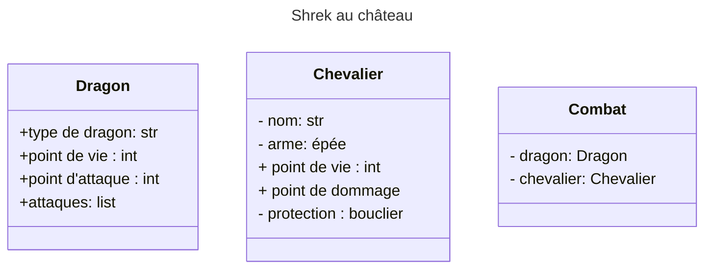

# Énoncer

## Résumer
Un chevalier veut aller secourir la princesse du dangereux dragon. Pour y arriver, celui-ci à besoin d'un équipement,
pour réussir à vaincre le fameux lézard cracheur de feu. Il aura besoin d'une arme et d'une armure, et il doit savoir 
de quel type de dragon il s'agit. Il doit se battre avec le dragon, et à la fin du combat, l'un des deux doit sortir victorieux.

